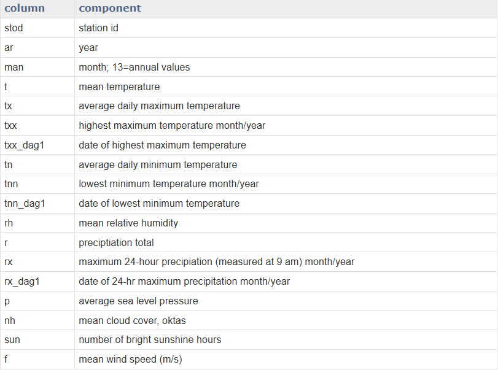
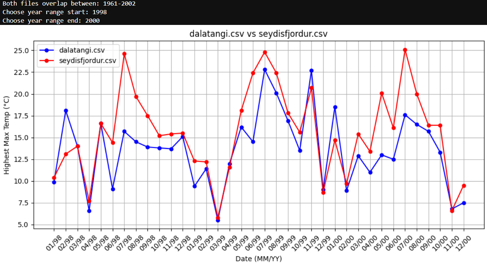
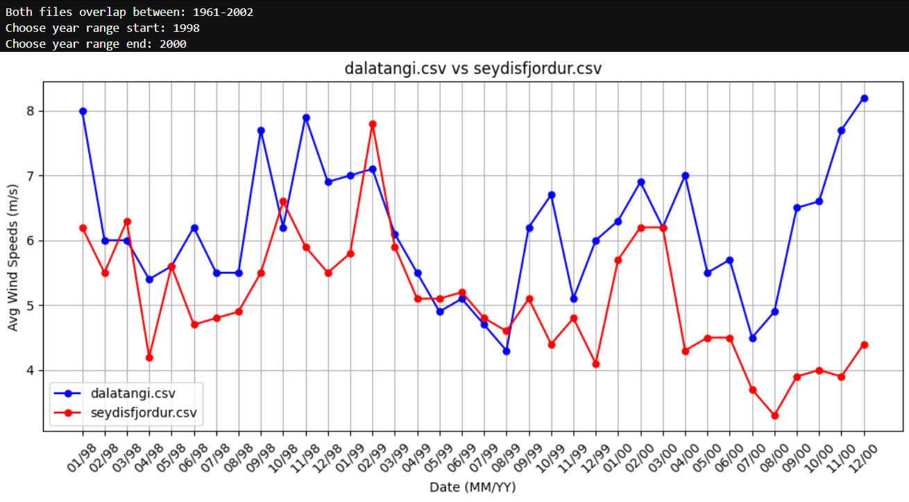

# Goal
The goal of this script is to take two Icelandic weather station CSVs as input and display a graph comparing the two based on a chosen climate variable. The data being used for this project can be found at https://en.vedur.is/climatology/data/. 

## Climate Variable Table
The variables used on the CSVs are not initially intuitive, so here's a table of contents. Again, courtesy of https://en.vedur.is/climatology/data/.

# Example Graphs using Dalatangi and Seydisfjordur Station Data

